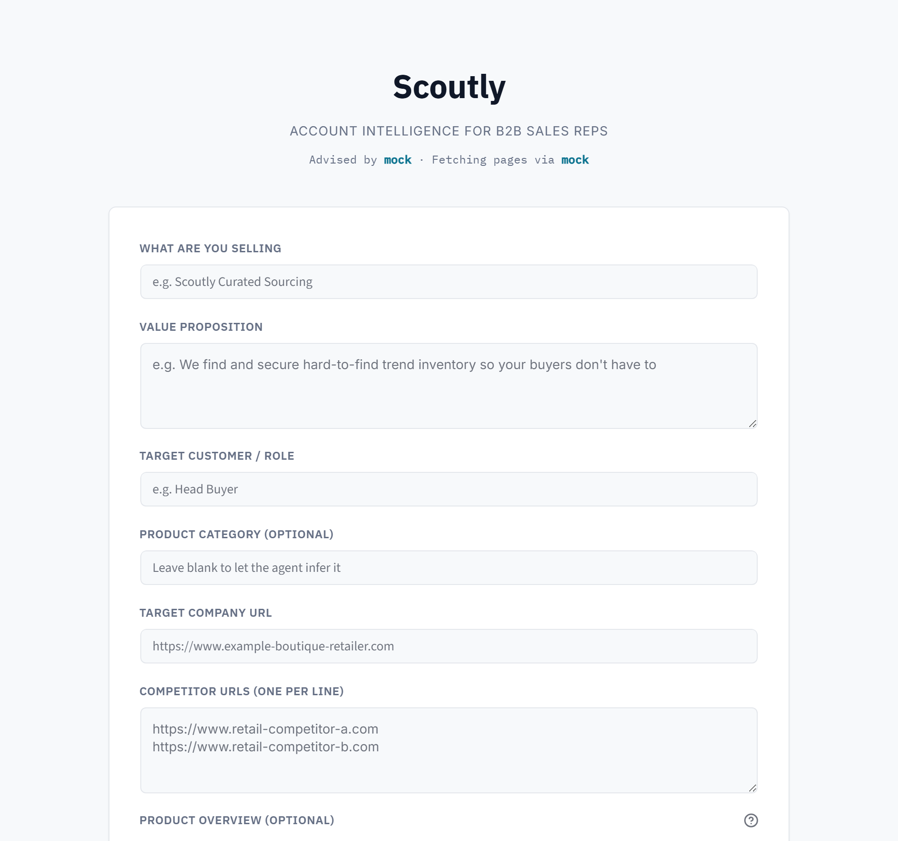
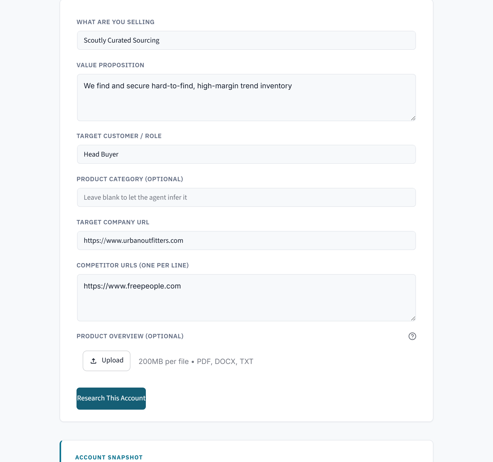

# Scoutly — Multi-Agent B2B Account Intelligence Assistant (CAP 931 Capstone)

Scoutly helps a B2B sales rep research a prospective company before
outreach. Give it what you're selling, your value proposition, the target
company's URL, and its competitors' URLs, and five AI agents chain
together to produce a one-page account intelligence brief: company
strategy, leadership, press/compliance initiatives, competitive
positioning, a public-filing summary, a sourcing-strategy recommendation,
and a recommended approach — with real, clickable source links.

This was built for the Per Scholas CAP 931 capstone assignment ("Build a
Sales Agent Prototype Using Multi-Agent GPT Models"). It runs on Claude by
default, with OpenAI and Groq available as drop-in alternatives.

Setup and dependencies are managed with **[uv](https://docs.astral.sh/uv/)**.

## 1. Quick start

There are two ways to run Scoutly: the command-line demo, and a
browser-based version.

**Command line** (three scripted account-research scenarios, printed to the
terminal):

```bash
uv sync                  # installs everything from pyproject.toml / uv.lock
uv run main.py            # runs the 3-scenario demo — no API key or network needed (mock LLM + mock fetcher)
uv run pytest -q          # runs the test suite — also no API key or network needed
```

**Web UI** (a single browser form, built with Streamlit):

```bash
uv sync
uv run streamlit run streamlit_app.py
```

That opens a local page where you enter your product, value proposition,
target contact, and the prospect's company + competitor URLs, and get back
an Account Snapshot → Company Research → Competitive Landscape →
Recommended Sourcing Strategy → one-page Account Brief, plus a follow-up
box for logging a prospect's objection. Without an API key it falls back
to mock LLM responses (the page-fetch step still runs for real against
whatever URLs you enter, since that doesn't need a key).

<p align="center">
  
  <br><em>The intake form</em>
</p>

<p align="center">
  
  <br><em>Account Snapshot and Company Research results for one scenario</em>
</p>

To run either one against a real model, copy `.env.example` to `.env`, add
your API key(s), and set which provider to use:

```bash
cp .env.example .env
# edit .env: set SCOUTLY_PROVIDER=anthropic, ANTHROPIC_API_KEY=sk-ant-..., SCOUTLY_FETCH_MODE=http
uv run main.py
```

Supported LLM providers: `anthropic` (recommended default), `openai`, `groq`, `mock`.
Supported fetch modes: `http` (real page fetches), `mock` (offline canned pages).

## 2. Technologies used

| Technology | What it's doing here |
|---|---|
| **Python 3.12** | The language the whole project is written in. |
| **uv** | Installs dependencies and manages the virtual environment. Replaces `pip` + `requirements.txt` with one tool that also pins exact versions (`uv.lock`). |
| **Anthropic SDK (Claude)** | The default LLM provider — the model that reads research input and writes the JSON responses. |
| **OpenAI SDK** | An alternate LLM provider, kept for parity with the original assignment brief. |
| **langchain-groq** | An alternate, free-tier LLM provider (Groq), used through LangChain's `ChatGroq` wrapper since Groq doesn't have its own lightweight SDK. |
| **requests** | Fetches the target company's and competitors' actual web pages server-side. |
| **beautifulsoup4** | Parses fetched HTML into clean text plus a filtered list of leadership/press/careers subpage links. |
| **SEC EDGAR full-text search API** | Free, no-key lookup of a public company's real 10-K filings (accession numbers, dates, filing URLs), plus a deeper fetch of the actual Risk Factors/MD&A/Cybersecurity section text from the primary filing document — satisfies the brief's "insight from public 10-K reports" requirement with verifiable, real disclosure language, not just metadata. |
| **pypdf** / **python-docx** | Extract text from an optionally-uploaded product-overview file (PDF/DOCX; `.txt` needs no library) — `document_intake.py`. |
| **Pydantic** | Defines the exact JSON shape each agent must return (`schemas.py`) and rejects anything that doesn't match, before it can break the next step in the pipeline. |
| **python-dotenv** | Loads API keys from a local `.env` file so they never get hardcoded or committed. |
| **Streamlit** | Builds the browser-based web UI (`streamlit_app.py`) and hosts it for free on Streamlit Community Cloud. |
| **pytest** | Runs the 55 automated tests. |
| **ruff** | Lints and formats the code (catches unused imports, style issues, common bugs). |

Everything above is declared in `pyproject.toml`, with exact versions
pinned in `uv.lock`. `requirements.txt` is a second copy of the same
dependency list, generated for Streamlit Cloud's build system, which reads
`requirements.txt` instead of `uv.lock`.

## 3. How it's put together

```
pyproject.toml / uv.lock   uv-managed dependencies
requirements.txt           dependency list for Streamlit Cloud's build (mirrors uv.lock)
main.py                    command-line demo entry point / scenario runner
check_for_updates.py       reruns research for a saved account and reports new signals (see section 8)
eval_models.py             empirical Claude/GPT-4o-mini/GPT-OSS comparison harness (see section 9)
streamlit_app.py           browser-based web UI, same pipeline as main.py
.streamlit/config.toml     Streamlit theme (light, teal accent — modern research-tool look)
orchestrator.py            wires the five agents together, fetches pages, manages memory
memory.py                  ScoutlyMemory: cross-run contextual memory for one account
schemas.py                 pydantic schemas — one per agent's required JSON shape
llm_client.py              pluggable model backend: Anthropic / OpenAI / Groq / Mock
web_research.py            page fetching + SEC EDGAR (filing metadata and real 10-K section text)
sourcing_channels.py       reference data on real trend-item sourcing channels (wholesale/liquidation/etc)
document_intake.py         extracts text from an optionally-uploaded PDF/DOCX/TXT product overview
agents/
  base_agent.py                 shared prompt-building, JSON parsing, retry, validation
  account_intake_agent.py       Agent 1 — structures the rep's product/company/competitor input
  company_research_agent.py     Agent 2 — extracts strategy/leadership/compliance/10-K from fetched pages
  competitor_agent.py           Agent 3 — extracts competitive positioning from fetched competitor pages (+ subpages)
  sales_recommendation_agent.py Agent 4 — talking points, objections, approach, sourcing/margin recommendation
  report_agent.py               Agent 5 — assembles the one-page Account Intelligence Brief
tests/
  test_llm_client.py          provider factory + mock output shape (all 5 roles)
  test_web_research.py        HTML/EDGAR-JSON/10-K-section parsing (pure functions, no live network) + mock fetcher
  test_document_intake.py     PDF/DOCX/TXT extraction against in-memory fixtures
  test_eval_models.py         pure-function pieces of the model-comparison harness
  test_memory.py              memory update hooks, dedup, persistence
  test_agents.py               each agent in isolation, role-boundary checks
  test_orchestrator.py         full pipeline, objection-handling, and check_for_updates integration tests
docs/
  ASSIGNMENT_BRIEF.md            original capstone assignment, transcribed
  model_comparison.md            generated by eval_models.py once real API keys are configured (not committed empty)
  screenshots/                   web UI screenshots
examples/
  sample_run_output/             a committed mock run (transcripts + memory + an alerts example) so you can see output without running anything
```

Each agent sticks to its own lane: it has its own system prompt, only
returns JSON matching a fixed schema (see `schemas.py`), and that output
gets checked with pydantic before the orchestrator or the next agent trusts
it. All five agents read and write to a shared `ScoutlyMemory` object, so
by the time the Sales Recommendation Agent runs, it already knows what
Account Intake, Company Research, and Competitor research found — and if a
prospect raised an objection on a past research run for the same account,
that carries forward too.

The orchestrator is the only piece of code that talks to all five agents —
no agent calls another agent directly. It's also the only piece of code
that fetches web pages: real page content is retrieved *before* an agent
runs and handed to it as plain input data, so no agent ever reasons about a
bare URL from general knowledge. In standard agentic-system terms, this
makes it a **chain** rather than a model-driven agent with tools: the
sequence is fixed by the orchestrator, not decided by the model, which
fits fine since nothing here needs dynamic tool selection.

## 4. What it takes as input — mapped to the CAP 931 brief

**Example scenario used throughout this README and `main.py`:** Scoutly
is pitched as a curated trend-item **sourcing service** — "we find and
secure hard-to-find, high-margin inventory so your buying team doesn't
have to chase drops themselves" — sold to real boutique/retail companies
(the target company). This keeps the sales direction ordinary (a rep
selling a service to a prospect, not the reverse) while staying in the
trend-item/resale space the sourcing-strategy feature is built around —
see section 7 for how that resale-margin angle becomes a real feature, not
just flavor text.

The brief asks for: product name, target company URL, product category,
competitors, value proposition, and target customer. Scoutly's intake
form (`streamlit_app.py`) and `main.py` scenarios collect exactly these:

| CAP 931 input | Where it's collected |
|---|---|
| Product Name | `rep_product_name` |
| Company URL | `company_url` |
| Product Category (LLM infers if blank) | `product_category` — Account Intake Agent infers it when left blank |
| Competitors | `competitor_urls` (one or more) |
| Value Proposition | `value_proposition` |
| Target Customer | `target_customer_name` |
| Optional: upload a proprietary internal sheet | `product_document_text` — a PDF/DOCX/TXT product overview uploaded via `st.file_uploader`, extracted by `document_intake.py`, summarized into `product_document_summary` and preferred over sparse manual fields when inferring `product_category` |

You can also send a follow-up prospect objection, which routes straight to
the Sales Recommendation Agent since handling objections is its job.

## 5. What it outputs — mapped to the CAP 931 brief

The brief asks for a comprehensive one-page report covering company
strategy, initiatives/press/compliance, competitive mentions, leadership
information, a public 10-K/financial summary, and action links. That's
exactly `AccountBriefOutput` (`schemas.py`), produced by the Report Agent:

| CAP 931 output requirement | Where it's produced |
|---|---|
| Company Strategy | `report.company_strategy` — Company Research Agent's `company_strategy`, condensed by the Report Agent |
| Sign-ups, press releases, key initiatives, regulatory compliance (GDPR/CCPA etc.) | `report.initiatives_and_compliance` — merged from Company Research's `key_initiatives` + `compliance_mentions` |
| Competitive Mentions | `report.competitive_mentions` — from the Competitor Agent's `notable_mentions` / `competitive_landscape` |
| Leadership Information (with quotes where available) | `report.leadership_information` — Company Research Agent's `leadership` list (name, title, quote/note), carried through unchanged |
| Product/Rating Summary from public 10-K reports | `report.financial_summary` — grounded in a real SEC EDGAR full-text-search lookup (`web_research.lookup_public_filings`); says "no public filings found" honestly for private companies |
| Action Links to source articles/press releases | `report.action_links` — every real URL an agent actually drew from, deduplicated |

Beyond the brief's required fields:
- `report.filing_highlights` — for the single most recent public filing (when the fetch backend is real HTTP, not mock), `web_research.fetch_filing_sections` retrieves the primary filing document and extracts the actual Risk Factors, MD&A, and Cybersecurity section text (not just the filing's metadata), and the Company Research Agent grounds 2-4 concrete highlights in that real disclosure language.
- `report.sourcing_recommendation` — given the target company's apparent trend focus (from Company Research), the Sales Recommendation Agent picks the best-fit sourcing channel and named platforms from `sourcing_channels.py` — a small reference table of real wholesale/liquidation/dropshipping/boutique/category-specific sourcing options — with margin reasoning grounded in that table's own notes, never invented.

Competitor research gets the same depth as the target company: both go
through `_fetch_pages_with_subpages` (homepage plus discovered leadership/
press/about/careers subpages), not just a single homepage fetch.

Every agent turn also produces a small self-scored evaluation block:

```json
{
  "evaluation": {
    "relevance": "0-10",
    "clarity": "0-10",
    "engagement": "0-10",
    "deal_likelihood": "0-10"
  }
}
```

Full transcripts (every agent's input/output for each account) get saved
to `output/transcript_<account_id>.json`, and each account's memory gets
saved to `output/memory_<account_id>.json`. Both are generated at runtime
and git-ignored.

## 6. Which model, and why

By default this runs on **Claude** (`claude-sonnet-4-6`) through the
`anthropic` SDK. I picked Claude because it's reliably good at sticking to
a strict JSON schema — that's the biggest technical risk in this project,
since one stray sentence outside the JSON breaks the whole pipeline.

You can switch providers with `SCOUTLY_PROVIDER`:
- `openai` — GPT-4o-mini by default, via the `openai` SDK.
- `groq` — GPT-OSS 120B by default, via `langchain-groq`'s `ChatGroq`. A
  good free-tier option for prototyping, though Groq's free lineup changes
  often — see the challenges table below.
- `mock` — canned offline responses, no API calls at all. This is the
  default, so `uv run main.py` and `uv run pytest` both work out of the box
  with zero setup.

Independently, `SCOUTLY_FETCH_MODE` controls the page-fetching backend
(`web_research.py`):
- `http` — real `requests` GETs against the company/competitor URLs
  entered, parsed with BeautifulSoup. Default for the deployed web app.
- `mock` — canned offline page content, no network calls. Default for
  `main.py` and the test suite, so grading and CI stay free and reliable.

## 7. Optional enhancements implemented

| CAP 931 optional enhancement | How Scoutly implements it |
|---|---|
| Alert system for regulatory/product/hiring signals | Two layers: `sales_recommendation.time_sensitive_signals` flags signals inline in the brief; `check_for_updates.py` (section 8) is the real rerun-and-detect-changes mechanism, meant to be invoked by an external scheduler |
| Product overview / internal sheet upload | `document_intake.py` + the Streamlit file uploader (section 4) — PDF/DOCX/TXT |
| Deeper 10-K analysis | `web_research.fetch_filing_sections` (section 5) — real Risk Factors/MD&A/Cybersecurity text, not just filing metadata |
| Empirical model selection | `eval_models.py` (section 9) — measured JSON validity, schema compliance, an unsupported-claims proxy, latency, and cost across providers, not just a stated rationale |
| Improved output strategy | The Report Agent exists specifically to synthesize four agents' output into one coherent one-pager instead of handing the rep four separate JSON blobs |
| Domain-specific value-add beyond the base brief | `sourcing_recommendation` (see section 5) — a real, table-grounded resale-channel/margin recommendation, not just generic sales advice |
| Deployment | Streamlit Community Cloud (see section 1) |

## 8. Checking for account updates

`ScoutlyOrchestrator.check_for_updates(company_url, competitor_urls)`
reruns just Company Research + Competitor (not the full five-agent chain)
and reports which `known_account_facts` are genuinely new since the last
time the account was researched — the real, working half of an "alert
system": rerun and detect changes.

```bash
uv run check_for_updates.py --account-id account_001
```

This loads the account's saved memory, reruns research, saves the updated
memory back, prints a diff, and appends it to
`output/alerts_<account_id>.json`. If `SCOUTLY_ALERT_WEBHOOK_URL` is set,
it also POSTs a short summary there (Slack/Teams/email-via-Zapier all
accept a plain webhook) — a no-op otherwise.

**Why this is a script and not a background feature of the app itself:**
Streamlit Cloud's free tier has no persistent scheduler, and a Streamlit
app has no way to wake itself up on a timer. The honest way to get the
"periodically rerun and notify" behavior a real alert system needs is to
invoke this script from something that *can* run on a schedule:

```bash
# cron (Linux/macOS), once a day at 7am
0 7 * * * cd /path/to/scoutly && uv run check_for_updates.py --account-id account_001
```

On Windows, create a Task Scheduler daily trigger whose action runs the
same command with this project's folder as the working directory.

## 9. Comparing models empirically

```bash
ANTHROPIC_API_KEY=sk-ant-... OPENAI_API_KEY=sk-... GROQ_API_KEY=gsk-... uv run eval_models.py
```

Runs the same fixed account-research scenario through the full pipeline
once per available provider, with `fetch_mode=mock` held constant so only
the LLM varies between runs, and reports:

| Metric | How it's measured |
|---|---|
| Schema compliance | Did all 5 agents validate without raising `AgentError` |
| Retries needed | Total `generate()` calls beyond the 5 expected — each agent gets one built-in retry on invalid JSON |
| Unsupported sources | Cited `sources` that fall outside the URLs `MockFetcher` actually made available for that scenario — an automatable proxy for "did it invent a source" |
| Latency | Wall-clock seconds for the full run |
| Estimated cost | Real token usage from each provider's SDK response (`LLMClient.last_usage`) × a small, clearly-labeled-as-approximate pricing table |

No provider without an API key configured gets a result row — this repo
does not ship a fabricated comparison table. Run it yourself once you have
real keys; the report is saved to `docs/model_comparison.md`.

## 10. A guardrail built in on purpose

The assignment didn't ask for this, but the Sales Recommendation Agent is
explicitly instructed not to pressure a prospect who's raised a real
objection, and to address it plainly rather than talk past it. An agent
that just pushes "buy now" no matter what the prospect says isn't a very
trustworthy sales tool, so this felt worth building in even though it
wasn't spelled out in the brief.

## 11. Testing

```bash
uv run pytest -q
```

55 tests cover the LLM provider factory (all 5 agent roles' mock output
shapes), the page-fetching layer (HTML/EDGAR-JSON/10-K-section parsing as
pure functions, no live network calls), document text extraction (PDF/
DOCX/TXT fixtures built in memory), the model-comparison harness's pure
functions, memory update/dedup/persistence, each agent in isolation
(schema validation, plus checks that no agent's output leaks fields that
belong to another role), and the full pipeline end to end (all five agents
running in sequence, memory updating correctly, objection follow-ups
routing to the right agent, `check_for_updates` correctly rerunning only
Company Research + Competitor and detecting new facts). Everything runs
against the mock LLM client and mock fetcher, so the whole suite is free
and works without internet access.

## 12. Security note: fetching user-supplied URLs

Because the app fetches company/competitor URLs a user types into a public
form, `web_research._is_safe_url()` blocks non-http(s) schemes and resolves
the hostname to reject loopback/private/link-local addresses before any
request is made — a basic SSRF guard, since a URL-fetching feature exposed
on a public deployment is otherwise a way to probe internal network
addresses from the server.

## 13. Timeline

- Architecture, schemas, memory model, mock client, pipeline wiring,
  provider integrations, and initial test suite for the five-agent
  account-research pipeline.
- Added the real page-fetching layer (`web_research.py`, `requests` +
  BeautifulSoup) and the free SEC EDGAR full-text-search lookup, so
  research is grounded in actually-retrieved public information instead of
  an LLM guessing about a URL it never saw.
- Added the table-grounded sourcing-strategy recommendation
  (`sourcing_recommendation`, `sourcing_channels.py`) so the resale-margin
  angle became a real, differentiated feature rather than generic sales
  advice.
- Split into its own standalone repository under the name Scoutly, with a
  full visual redesign to a clean B2B SaaS look.
- Refined the visual identity further into a quieter, high-end look —
  deep charcoal palette, serif display type, muted brass accent — to
  better match the boutique/luxury retail clientele Scoutly's example
  scenarios target, without reverting to the earlier boutique-concierge
  styling's sparkle effects.
- Added competitor subpage discovery (bringing competitor research to the
  same depth as company research), an optional product-overview upload,
  real 10-K section-text analysis, a rerun-based account-update checker
  (`check_for_updates.py`), and an empirical model-comparison harness
  (`eval_models.py`).
- Moved the visual identity again, this time to a light, cool-toned,
  clinical research-tool look (IBM Plex Sans/Mono, a precise teal accent,
  crisp bordered cards) closer to the modern B2B intelligence tools in
  Scoutly's own space, and substantially expanded the production
  architecture documentation below to explicitly cover authentication,
  RBAC, tenant isolation, managed secrets, HTTPS termination, database
  design, data retention, background jobs, horizontal scaling,
  monitoring, and backup/recovery.

## 14. Problems I ran into, and how I fixed them

| Problem | Fix |
|---|---|
| Models sometimes wrap JSON in prose or code fences even when told not to | `BaseAgent._extract_json` strips that out and retries once with a corrective message before giving up |
| Agents drifting into another agent's job over a longer research run | Each system prompt states its role boundary twice, and `tests/test_agents.py` checks directly that no cross-role fields leak through |
| The Report Agent's own prompt describes handing off from "the Company Research Agent" and "the Competitor Agent" by name, which broke `MockClient`'s naive substring-based role detection (it matched the *first* agent name mentioned, not the agent actually running) | Switched `MockClient.generate` to match only the opening "You are the `<Role>` Agent" sentence via regex instead of scanning the whole prompt for any agent name |
| SEC EDGAR's legacy `browse-edgar` atom endpoint returns zero entries for a plain company-name search (it only returns filing entries for an exact single-CIK match) | Switched to EDGAR's full-text-search JSON API (`efts.sec.gov`), which matches by company name against real filed documents and returns genuine accession numbers/dates/URLs — verified live against Palo Alto Networks' real 10-K filings |
| The company-name guess fed into EDGAR (split the fetched homepage's `<title>` on its first separator, keep the first half) silently returned zero filings for real sites whose title puts the tagline first and the company name second — e.g. paloaltonetworks.com's title is "Leader in Cybersecurity... - Palo Alto Networks" | `_guess_company_name_candidates` now tries both halves of the separator against EDGAR and keeps the first one that returns real filings, instead of assuming one title order |
| A 10-K's table of contents lists "Item 1A Risk Factors" near the top of the document, so a naive first-match regex search for that header grabs the TOC line, not the actual section | `_extract_section` matches the **last** occurrence of a section header instead of the first — verified live: correctly extracted real Risk Factors/MD&A text from Palo Alto Networks' 10-K, and correctly returned empty for Cybersecurity on a 2019 filing that predates that disclosure requirement |
| EDGAR filing index pages don't consistently mark which linked document is the primary filing vs. an exhibit | `_find_primary_document_url` uses EDGAR's own `/ix?doc=...` inline-XBRL-viewer wrapper link, which reliably points at the primary document, falling back to the first same-folder `.htm` file for older, pre-iXBRL filings |
| A URL-fetching feature on a public form is a potential SSRF vector | Added `_is_safe_url()`: blocks non-http(s) schemes and resolves+rejects private/loopback/link-local hostnames before fetching |
| Needing to test and demo without burning API credits, requiring a key, or depending on live network access | `MockClient` + `MockFetcher` produce schema-valid fixture data for offline runs and the whole test suite |
| Wanting pinned, reproducible dependencies instead of a loose `requirements.txt` | Switched to `uv init` / `uv add`, which gives you `pyproject.toml` plus a fully pinned `uv.lock` |
| Hugging Face Spaces turned out to require a paid plan for anything that runs real Python (Gradio/Docker); the free tier is Static-only, which can't call an API without exposing the key in the browser | Built the web UI in Streamlit instead and deployed to Streamlit Community Cloud, which is free and has real server-side secrets |
| The Groq model this project defaulted to got discontinued after deployment, which only showed up as a `groq.NotFoundError` once the app was live | Swapped to `openai/gpt-oss-120b`, Groq's flagship production chat model — Groq's free-tier lineup turns over fast enough that this default may need to change again; check `console.groq.com/docs/models` for the current production list |
| `st.secrets` raises an exception instead of just returning nothing when there's no `secrets.toml` file, which crashed the app for anyone running it locally without Streamlit Cloud secrets configured | Wrapped that check in a try/except so a missing secrets file is treated as "no key yet," not a crash |

## 15. Requirements coverage

Scoutly meets the full scope of the CAP 931 brief:

| Area | Status | Details |
|---|---|---|
| Inputs, including the optional proprietary-sheet upload | ✅ | Section 4 |
| LLM model selection & prompt engineering (5 distinct agent roles) | ✅ | Sections 3, 6 |
| Memory retention across research runs | ✅ | `memory.py`, section 3 |
| Data integration (real page fetches, real SEC EDGAR filings and 10-K section text, competitor subpage discovery) | ✅ | Section 5, `web_research.py` |
| Outputs (strategy, initiatives/compliance, competitive mentions, leadership, 10-K summary, action links) | ✅ | Section 5 |
| Optional enhancements (rerun-based alert system, document upload, deeper 10-K analysis, empirical model comparison, output-strategy synthesis, sourcing/margin recommendation) | ✅ | Sections 7-9 |
| Production deployment considerations | ✅ | Section 16 |
| Documentation (setup, time management, challenges, requirements, system outputs) | ✅ | This README + `examples/sample_run_output/` + `docs/screenshots/` |

Every input and output the brief describes, including its optional items,
is implemented.

## 16. If this went to production

What's already true of the prototype:

- **Swappable LLM providers**: switching between Anthropic/OpenAI/Groq/mock is one factory call or one environment variable.
- **Swappable fetch backend**: same pattern for the page-fetching layer (`web_research.get_fetcher`), so a production deployment could swap in a headless-browser fetcher for JS-heavy sites without touching agent code.
- **Schema enforcement**: pydantic catches any drift in the model's output before it reaches a user or the next agent.
- **Cost control**: mock mode is already fully separate from paid inference and live fetches, so tests, CI, and grading never touch API quota or the network.
- **Reproducibility**: `uv.lock` pins the exact dependency graph, so `uv sync` gives you the same environment anywhere.

What an enterprise, multi-tenant version would add, organized around the areas a real deployment has to answer for:

**Authentication and access control**
- Real user authentication (SSO/OAuth through an identity provider such as Okta, Azure AD, or Auth0) in place of the single shared browser session the prototype uses today.
- Role-based access control (RBAC): a rep should be able to research and view their own accounts; a sales manager should see every rep's accounts on their team; an admin manages provider keys and webhook destinations. The prototype has no notion of roles — every user of the deployed app has the same implicit access.
- Tenant isolation: each company using Scoutly needs its own account/memory namespace so one customer's research, uploaded product documents, and account history are never visible to another. `ScoutlyMemory.account_id` already exists as a partition key; production would enforce that boundary at the database and API layer, not by file-naming convention.

**Secrets and network security**
- Managed secrets: API keys come from a local `.env` file or Streamlit Cloud's secrets manager today. A production deployment would use a dedicated secrets manager (AWS Secrets Manager, GCP Secret Manager, HashiCorp Vault) with rotation and audit logging, not a flat secrets file.
- HTTPS termination: Streamlit Cloud already terminates TLS for the current deployment. A self-hosted production deployment would need this handled explicitly, typically at a load balancer or reverse proxy in front of the app, not inside the application process itself.
- The existing SSRF guard (`web_research._is_safe_url`) stays load-bearing in any deployment, since the app fetches user-supplied URLs server-side regardless of hosting.

**Data persistence and privacy**
- Persistent database design: `ScoutlyMemory` is JSON files today. Production would move to a real schema, likely on Postgres: an `accounts` table keyed by tenant and account ID, a `research_history` table for the append-only research log, and a `documents` table for uploaded product overviews, with the current dataclass's fields becoming columns instead of one JSON blob.
- Data retention and privacy controls: uploaded product documents and fetched competitor page text can be sensitive. Production needs an explicit retention policy for research history and uploaded documents, a real deletion path (tenant offboarding, or a GDPR/CCPA-style deletion request), and encryption at rest for anything stored.

**Background jobs and horizontal scaling**
- Background-job infrastructure: `check_for_updates.py` is real rerun-and-diff logic today, invoked manually or by an external scheduler such as cron or Task Scheduler. Production would run it as an actual job queue per tenant per account (Celery, AWS SQS plus Lambda, or a managed scheduler like GCP Cloud Scheduler triggering a Cloud Run job), decoupled from the web process.
- Horizontal scaling: the prototype is a single Streamlit process holding the orchestrator and memory in `st.session_state`. Production would separate the stateless agent-orchestration layer, scalable behind a load balancer, from the stateful memory layer (the database above), so multiple app instances can serve requests concurrently.
- Retries: currently one corrective re-prompt if a model call returns malformed JSON. Production needs real exponential backoff and rate-limit handling for both LLM calls and page fetches, since SEC EDGAR in particular expects well-behaved, rate-limited traffic.

**Monitoring and recovery**
- Monitoring: full transcripts are already saved per account. Production would feed those into structured logging and metrics (for example OpenTelemetry into Datadog or Grafana), tracking per-agent latency, retry rate, and the same schema-compliance and unsupported-source signals `eval_models.py` measures, continuously rather than in a one-off comparison run.
- Backup and recovery: the database above needs standard point-in-time backups, a tested restore path, and a defined recovery point/time objective, none of which a single JSON file per account can meaningfully provide.
